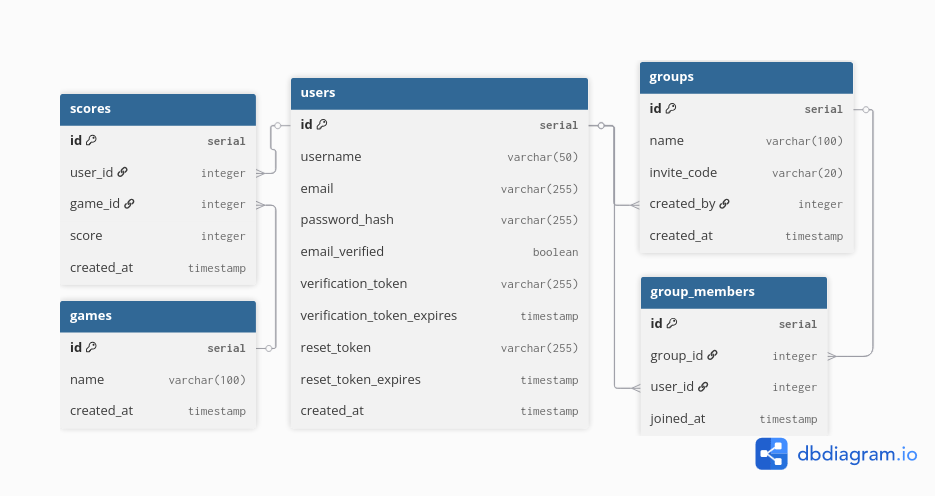

# BetterThanYou

A competitive mini-game platform. Play skill-based games, climb leaderboards, compare head-to-head, and compete in private groups.

**Live at [betterthanyou.gg](https://betterthanyou.gg)**

---

## Current Games

- **Color Vision** - Spot the odd color out of six blocks. Colors get harder each round.
- **Typing Speed** - Type as many words as you can in 30 seconds. Score = WPM × (accuracy/100)².
- **Coin Flick** - Physics-based canvas game. Flick coins across a table - exactly one must stay.

## Features

- Global per-game leaderboards
- Personal stats - daily, weekly, monthly and all-time bests
- Head-to-head compare against any player
- Private groups with invite codes and group leaderboards
- Email verification and password reset via Resend

---

## Tech Stack

| Layer     | Technology                                |
| --------- | ----------------------------------------- |
| Frontend  | React 19, Vite, React Router 7            |
| Backend   | Express 5, Node.js                        |
| Database  | PostgreSQL                                |
| Auth      | bcrypt + JWT                              |
| Email     | Resend (transactional)                    |
| Hosting   | Vercel (frontend), Railway (backend + DB) |
| DNS / CDN | Cloudflare                                |

---

## Database Schema



---

## Running Locally

```bash
# Backend
cd server
cp .env.example .env       # local psql credentials
npm install
npm run dev

# Frontend
cd client
npm install
npm run dev                 # runs on http://localhost:5173
```

Requires Node 20+ and a local PostgreSQL instance.

---

## Roadmap

- More games
- Expanded group features
- Deeper statistical analysis (trends, percentiles, graphs)
- Native iOS and Android apps
